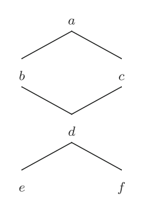
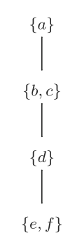
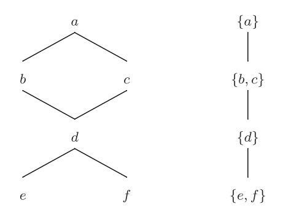

```{r setup, include = FALSE}
# set the local path of the comparison-class folder
path = "~/cocolab/comparison-class/"
#path = "~/Documents/research/comparison-class/"

# import required libraries
library(knitr)
library(ggplot2)
library(cowplot)
library(pander)
```

# Introduction

Suppose you walk into a coffee shop and overhear someone say “the coffee is warm.” What do you think they meant by that? If the person is drinking a [cappuccino](https://en.wikipedia.org/wiki/Cappuccino), warm might mean around 60&deg;C or 160&deg;F. In contrast, if the person is drinking an [iced coffee](https://en.wikipedia.org/wiki/Iced_coffee), warm might mean around 15&deg;C or 59&deg;F. It is apparent that in order for us to ground a quantitative interpretation of the gradable adjective “warm,” we will need to find the set of similar entities that compare with the type of coffee in this utterance: we need to find the comparison class.

The question of what "warm" means directly and how to infer its meaning, as well as many other _gradable adjectives_, is an active area of research. There are two types of gradable adjectives: relative and absolute. In our work, we focus on relative gradable adjectives (e.g., tall, heavy, hot) because of their vagueness and context-sensitivity. We also focus on measurable adjectives for modeling simplicity. This allows us to study how the comparison class varies with respect to context while keeping the utterance fixed; thus, we obtain more flexibility in trying to elicit the comparison class in our experiments.

## What are comparison classes?

In @bale2011scales, **comparison classes** are described as the implicitly or textually determined sets that relativize the standard for some gradable adjective. In our previous example, the comparison class would have been either $C$, the set of all cappuccinos, or $I$, the set of all iced coffees. A standard for "warm" could then be obtained by performing some operation on the scale associated with either of these sets, such as calculating the mean temperature over the set of cappuccinos. Note here that the standard is indeed relativized for "warm" because the mean temperature over $C$ would differ significantly from the mean temperature over $I$. Here, we see that several steps are required to infer a quantitative interpretation of "warm":

1. Construct a scale for the gradable adjective (not necessarily equal to $\mathbb{R}$)
2. Compute or otherwise obtain a standard for the gradable adjective by performing some operation on the scale
3. Use a measure function $\mu$ to map the kind, or the subject of the utterance, to a value on the scale
4. Determine the truth value of the proposition given the interpretation (i.e. the value obtained from the scale)

Some notations and definitions that underlie the theory of comparison classes will be described as we discuss these steps. Though we are interested in determining the **scale** of a particular gradable adjective, it is not always so direct. We often have to start with and derive the scale from what is known as a **quasi-order**, a binary relation on a particular set. Without any context or restriction, this is a relation on the set $\mathbb{U}$, known in discrete mathematics as the _universe of discourse_ (i.e. the set of all things). This relation has the properties of reflexivity and transitivity (see [here](http://www.inf.ed.ac.uk/teaching/courses/dmmr/slides/13-14/Ch2.pdf) for a more detailed discussion on relations in set theory). Figure 1 is an example of a quasi-order formed from the gradable adjective "warm":

<center>$\text{WARM}$</center>
<center></center>
<center><font size="2">Figure 1: A graph describing the quasi-order for the relative gradable adjective "warm" with members from an unrestricted set.</font></center><br>

The relation that corresponds to this graph is shown below:

$$\begin{equation}
\text{WARM} = \{(x, y) : x \text{ is (at least) as warm as } y\}
\end{equation}$$

What prevents quasi-orders from becoming scales is that they are not antisymmetric. This means that two cups of cappuccino (take $b$ and $c$ from the graph) with the same temperature will exist separately instead of being binned into the same category. For the sake of creating a one-to-one, kind-to-value measure function, we would like to bin these two cups of cappuccino into the same category. Fortunately, we can convert quasi-orders into scales by collapsing "equivalent" kinds into an _equivalence class_, forming what @bale2011scales calls _quotient structures_. The details of equivalence classes and quotient structures are outside of the scope of this work. They can simply be thought of as bins of entities with equal representations, such as temperature, and as scales, respectively. Taking the quasi-order from before, we can convert it to the scale in Figure 2.

<center>$\text{WARM}$</center>
<center></center>
<center><font size="2">Figure 2: A graph describing a scale for the relative gradable adjective "warm" with similar members from an unrestricted set collapsed into an equivalence class.</font></center><br>

At this point, we can apply a measure function $\mu$ to the kind "coffee", map it to its corresponding equivalence class, and retrieve the value that we have associated with this equivalence class. (Note that we associate "value" with "equivalence class" and scales loosely; since the gradable adjectives we are working with are measurable, we can directly assign a numerical value to the equivalence class or to positions on the scale.) The problem is that we can still pass _any_ kind into this measure function. This is where comparison classes come into play. Left unspecified, the quasi-order (and the equivalence classes in the scale) for warm could contain entities that are not restricted to cups of cappuccino or iced coffee ($x$, $y$ $\in \mathbb{U}$). The comparison class restricts the construction of the quasi-order and the scale to only include members of that class ($x$, $y$ $\in C$ or $x$, $y$ $\in I$). Figure 3 demonstrates this feature.

<!-- <center></center> -->
<center><font size="2">Figure 3: The graph on the left represents a quasi-order and the graph on the right represents a quasi-order that was converted to a linear order by means of collapsing the nodes into their equivalence classes.</font></center><br>

With our new scale, we _could_ simply gather some prior data on the members of the comparison class, directly and deterministically calculate a standard given this data, and apply the measure function to retrieve values from the prior data and assign truth values to the propositions of utterances. This is where we will depart from @bale2011scales and consider the remaining steps with a probabilistic perspective. 

# Framework

## Adjectives model

## Extension with comparison classes

# Experiment

The pilot experiment was run on Amazon Mechanical Turk (MTurk) with 30 participants. Each participant had to answer 18 questions in a fill-in-the-blank and paraphrase format. The experiment took about five minutes and participants were paid $0.60. You can find the experiment [here](https://mhtess.github.io/comparison-class/).

Here is what a typical experiment trial would look like: 

> Bill is a goat. John says, "Bill is tall." What do you think John meant? "Bill is tall for a `goat`."

The first and second sentences are the context and target sentences, respectively. The 18 questions were unique pairs of these sentences. The third and fourth sentence are the prompts, where the participant gives an answer. The name(s) were assigned to each trial randomly and uniquely from a pool of names normalized for race [citation needed].

In addition, each participant was randomly assigned a condition that changed the way the final line was phrased. The two conditions were "for a" and "relative to." Given the fact that responses like "Drink" and "drink" might be miscategorized in separate bins, we compare responses that were parsed by hand with the [caveman](https://github.com/erindb/caveman) parser. In the next section, we graph the results of peoples' responses and finish with a brief analysis and discussion in the section thereafter.

# Results

In the graphs below, the names of some of the bins were cut down due to space limitations. The full respones can be read from [here](https://github.com/lopez-brau/comparison-class/blob/master/data/pilot-1-paraphrase/pilot-1-paraphrase-pairs.csv).

## "for a" Condition

```{r fig.align = "center", fig.height = 6, fig.width = 8, echo = FALSE, results = "asis"}
#source(paste(path, "scripts/make-plots-condition-1.R", sep = ""))
```

## "relative to" Condition

```{r fig.align = "center", fig.height = 6, fig.width = 8, echo = FALSE, results = "asis"}
#source(paste(path, "scripts/make-plots-condition-2.R", sep = ""))
```

# Analysis

## "for a" Condition

* Pair 6: The top two answers for this pair were "diamond necklace" and "diamond." While the former makes sense, given the context, the latter does not. This may have been a mistake rather than an honest interpretation but more data would be needed to confirm if this pair elicits the comparison class "diamond" for the subject "diamond necklace."
* Pair 7: Most participants chose "movie" instead of "movie ticket," resulting in the following sentence: "The ticket is cheap for a movie." It seems that the subject "ticket" elicits the comparison class "movies," or more generally the price to see a movie.
* Pair 9: I chose to separate "road trip" and "drive" because the former has the connotation of long trips where the latter is less inclined to any particular length.
* Pair 11: "doctor's office" and "doctor's appointment" were the two most common answers but elicit different comparison classes. With regard to the "doctor's appointment" response, it seems that participants here relied too heavily on the context.
* Pair 13 & 14: The top answer was "4-year-old" for the first pair and "man/woman" for the second. This is likely because the distributions of heights among 3-, 4-, and 5-year-olds are much more different than the distributions of heights of 24-, 25-, and 26-year-old adults; hence, it would be more informative to communicate the direct age of toddler than an adult when talking about height.

## "relative to" Condition

In general, most of the pairs in this condition experienced too much variability in responses. More of this will be touched on in the next section.

### Word usage

Participants in the "relative to" condition habitually made use of the words "other" and "typical." A chart with this data is shown below:

```{r fig.align = "center", echo = FALSE, results = "asis"}
source(paste(path, "scripts/count-words.R", sep = ""))
panderOptions('table.split.table', Inf)
cat("<center>", sep = "")
pandoc.table(chart)
cat("</center>", sep = "")
```

<center><font size="2">Table 1: Word frequency data from the "relative to" condition</font></center><br>

The columns of the table correspond to:

* other.count: the number of times "other" occurred
* typical.count: the number of times the word "typical" occurred
* other.frequency: the frequency that the word "other" occurred (other.count / responses.total)
* typical.frequency: the frequency that the word "typical" occurred (typical.count / responses.total)


# Discussion

Looking at the data above, a stark difference between the conditions is the variability in responses: the “relative to” condition elicted far more unique responses than the "for a" condition. Also, the “relative to” condition elicited noun phrases, such as "other 4-year-olds," rather than nouns, such as “4-year-olds,” as in the "for a" condition.

To tackle variability in future experiments, we plan to look at how participant responses are encoded. Should the phrases "doctor's appointment" and "doctor's office" be encoded as similar or different responses? Hand-encoding responses can lead to large variations in results, leading to data that is not reproducible. We seek to apply a formal tool for encoding responses in future experiments.

To best elicit the comparison class in our experiments, we have decided to update our "relative to" condition with a "relative to a" condition. Once we improve our experiment design and obtain these elicited classes, we can then measure participants' background knowledge and interpretations using these contextual manipulations, incorporate it with the adjectives model in [1], and see if the knowledge from the classes we measured makes the right predictions for interpreting gradable adjectives.

# References