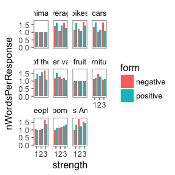

Comparison class models (RSA + BDA)
================
M. H. Tessler
7/21/2017

Model results
-------------

#### CogSci results (L1 model)

### L0 model

    ## 
    Read 12.8% of 9200000 rows
    Read 31.4% of 9200000 rows
    Read 49.9% of 9200000 rows
    Read 68.3% of 9200000 rows
    Read 86.4% of 9200000 rows
    Read 9200000 rows and 4 (of 4) columns from 0.401 GB file in 00:00:07
    ## [1] 1
    ## 
    Read 17.0% of 9200000 rows
    Read 34.9% of 9200000 rows
    Read 52.8% of 9200000 rows
    Read 71.3% of 9200000 rows
    Read 89.0% of 9200000 rows
    Read 9200000 rows and 4 (of 4) columns from 0.401 GB file in 00:00:07
    ## [1] 2
    ## 
    Read 21.1% of 9200000 rows
    Read 40.0% of 9200000 rows
    Read 58.6% of 9200000 rows
    Read 77.3% of 9200000 rows
    Read 95.9% of 9200000 rows
    Read 9200000 rows and 4 (of 4) columns from 0.401 GB file in 00:00:07
    ## [1] 3

#### Posterior predictives

    ## [1] "ccRSA model & cc inference task r^2= 0.0923895855635103"

    ## [1] "adjective s2 & vs task r^2=  0.993844517253438"

### Comparison class inference task

It looks that the L0 model is making the exact wrong prediction (i.e., the interaction). The L0 model doesn't have a way of separating listener knowledge (i.e., the comparison class used in the listener's degree prior) from speaker's intent (i.e., the comparison class used by the speaker). In our setup, the listener knows the target is a basketball player. The L0 model doens't have a way of knowing this, so it instead just samples a comparison class from the comparison class prior. So when it hears "tall", it thinks "basketball player" is the more likely comparison class.

Basically, the L0 model is answering "what do you think it is: Basketball player or person"? When it hears "he's tall", L0 thinks "basketball player!"

#### Speaker optimality parameters

Prior parameters

| cat                      | param |         MAP|  cred\_upper|  cred\_lower|
|:-------------------------|:------|-----------:|------------:|------------:|
| apple                    | mu    |  -0.2421365|   -0.1686824|   -0.3242438|
| apple                    | sigma |   0.6693339|    0.9186024|    0.1867853|
| basketball player        | mu    |   0.3300356|    0.4529453|    0.2566699|
| basketball player        | sigma |   0.1703280|    0.6936139|    0.0360787|
| bottle opener            | mu    |  -0.3719188|   -0.2664112|   -0.4932883|
| bottle opener            | sigma |   0.1501849|    0.6246309|    0.0018893|
| day in Fall              | mu    |  -0.1832997|   -0.0954720|   -0.2745425|
| day in Fall              | sigma |   0.0265982|    0.7032458|    0.0020068|
| day in Summer            | mu    |   0.4205906|    0.5623269|    0.3075428|
| day in Summer            | sigma |   0.2394355|    0.7025627|    0.0009280|
| day in Winter            | mu    |  -0.4127609|   -0.3136764|   -0.5633951|
| day in Winter            | sigma |   0.4595191|    0.7950359|    0.0005673|
| dishwasher               | mu    |   0.2553556|    0.3403765|    0.1807972|
| dishwasher               | sigma |   0.2649769|    0.6402767|    0.0275258|
| grape                    | mu    |  -0.4172633|   -0.3208683|   -0.5763468|
| grape                    | sigma |   0.5125054|    0.8409727|    0.0083021|
| gymnast                  | mu    |  -0.3146127|   -0.2180541|   -0.3912711|
| gymnast                  | sigma |   0.3041610|    0.6762965|    0.0372623|
| movie                    | mu    |   0.2963087|    0.4110638|    0.2163250|
| movie                    | sigma |   0.5682737|    0.8523357|    0.0748869|
| music video              | mu    |  -0.2151173|   -0.1135380|   -0.2961299|
| music video              | sigma |   0.4238750|    0.6951605|    0.0004482|
| soccer player            | mu    |   0.0700779|    0.1232712|   -0.0007272|
| soccer player            | sigma |   0.8931906|    1.0014732|    0.6963971|
| toaster                  | mu    |  -0.3890310|   -0.3068036|   -0.5592254|
| toaster                  | sigma |   0.1079790|    0.5698876|    0.0001496|
| video of the cute animal | mu    |  -0.3167035|   -0.2163679|   -0.4044253|
| video of the cute animal | sigma |   0.3491632|    0.6927508|    0.0305653|
| watermelon               | mu    |   0.3872194|    0.5097677|    0.2734021|
| watermelon               | sigma |   0.1274837|    0.6156030|    0.0014092|
